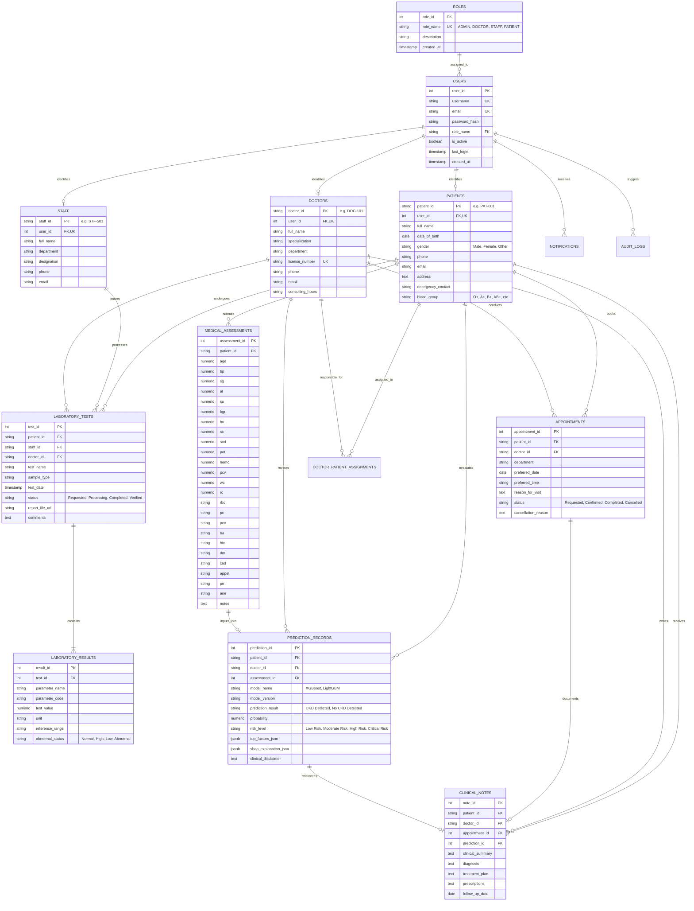

# Entity-Relationship (ER) Diagram & Relational Schema Documentation

## 1. System ER Diagram (Mermaid)

---

## 2. Normalization Analysis (Up to 3NF)

1. **First Normal Form (1NF)**:
   - All columns hold atomic, indivisible values.
   - Repeating groups (e.g. individual lab parameters like Creatinine, BUN, Potassium) are extracted into the dedicated child table `laboratory_results`.
   - Every table contains a well-defined Primary Key.

2. **Second Normal Form (2NF)**:
   - The schema satisfies 1NF.
   - No non-prime attribute is partially dependent on any composite primary key. Composite keys (e.g., `doctor_patient_assignments(patient_id, doctor_id)`) only establish associative identity.

3. **Third Normal Form (3NF)**:
   - The schema satisfies 2NF.
   - All non-key attributes are directly dependent **only** on the primary key, with no transitive functional dependencies (e.g., Doctor specialization is keyed under `doctors`, not redundantly stored across appointments).

---

## 3. Referential Integrity & Constraints
- **Primary Keys**: Assigned across all 14 entities.
- **Foreign Keys with Cascade Actions**:
  - `ON DELETE CASCADE` on patient child records (assessments, appointments, results).
  - `ON DELETE SET NULL` on technician/doctor audit references to preserve data provenance.
- **CHECK Constraints**: Numeric physiological bounds (e.g. `age BETWEEN 0 AND 130`, `bp BETWEEN 30 AND 260`), enum validations (`gender IN ('Male','Female','Other')`).
- **Unique Slot Constraints**: `UNIQUE(doctor_id, preferred_date, preferred_time)` prevents double-booking.
- **Database Views**:
  - `v_patient_360`: Real-time composite view of patient history, latest assessments, and predictions.
  - `v_doctor_workload`: Aggregated appointment and review metrics grouped per doctor.
  - `v_lab_queue`: Pending laboratory requests and abnormal count aggregations.
